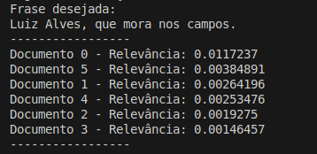
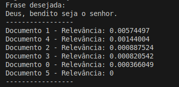
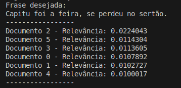
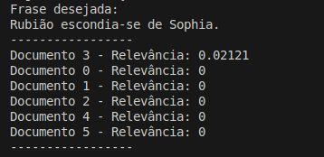
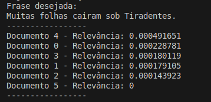
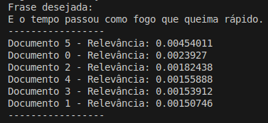
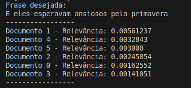
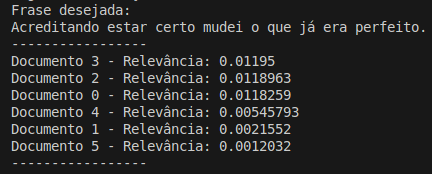

<p align="center"> 
  
</p>


<h1 align="center" font-size="200em"><b>Ranqueamento de Documentos | TF-IDF</b></h1>


<div align="center">


</div>

<br>

## Introdução

### Sobre o trabalho:
<p align="justify">
O TF-IDF (<i>Term Frequency-Inverse Document Frequency</i>) é uma medida estatística e um algoritmo dentro da ciência de dados, usado para determinar a importância da palavra de um documento em relação a um banco de documentos. Isso, então, pode ser usado para ranquear os documentos com base no grau de relevância deles em relação à palavra/frase selecionada.
</p>

<p align="justify">
Portanto, implementamos um algoritmo de ranqueamento de documentos em C++ usando o TF-IDF como o primeiro trabalho da disciplina de AEDS II, ministrada no Campus Divinópolis do CEFET-MG pelo professor Michel Pires Da Silva.
</p>

<br>

## Implementação:

### Bibliotecas utilizadas:
- `<cctype>` : Inclui o cabeçalho da biblioteca de C <ctype.h> e adiciona os nomes associados ao namespace std;
- `<fstream>` : Define várias classes que dão suporte a operações de iostreams em sequências armazenadas em arquivos externos.
- `<iostream>` : Declara objetos que controlam a leitura e a gravação nos fluxos padrão.
- `<list>` : Para a manipulação de dados utilizando a estrutura de lista bidirecionais;
- `<string>` : Para manipulação de strings;
- `<algorithm>` : Define as funções de modelo do contêiner da Biblioteca Padrão do C++ que executam algoritmos.
- `<cmath>` : Inclusão de funções matemáticas, tais como seno, cosseno, logarítmo; etc;
- `<codevct>` : Biblioteca utilizada para conversão dos dados de caracteres para UTF.
- `<locale>` : Para indicar para a máquina que algumas bibliotecas devem funcionar pensando na lingua portuguesa.
- `<set>` : Para armazenar e recuperar dados de uma coleção;
- `<sstream>` : Para operar em strings como fluxo de dados;
- `<unordered_map>` : Para criar e manipular tabelas hash de modo eficiente;
- `<vector>` : Para armazenar sequências dinâmicas de elementos.
- `<time.h>`: Biblioteca usada para medir o tempo de execução do programa.

### Funções:

- ```void tratarTexto(string &texto)```

  Essa função recebe uma string de texto, que é uma das palavras extraídas do documento, e faz o seu tratamento. Ela percorre as letras da palavra em um laço de repetição, diminuindo as maiúsculas com `tolower`. Usa o `wstring` e o `codevct` para tratar melhor as letras maiúsculas com acento. 
  
  Seu custo é estimado em O(n), com *n* sendo a quantidade de caracteres na string texto que passara pela função `tolower`.

- ```set<string> tratarFrase(string &frase, const set<string> stopwords)```
  
  Essa função abrange o tratamento geral de uma frase de entrada, inserida para o cálculo do TF-IDF. Ela percorre cada palavra da frase em um laço de repetição, com cada uma sendo tratada usando a função `tratarTexto` e suas stopwords são tratadas usando a função `RemoverStopWord`, retornando a frase de entrada tratada.

  Seu custo é estimado em O(n), com *n* sendo o número de palavras da frase. Como `tratarTexto` percorre cada letra da palavra, o custo real é de O(l * log x), em que l é o número total de letras da frase, e log x é o custo associado à biblioteca `<set>`, em que *x* é o número de stopwords.

- ```void RemoverStopWord(string &texto, const set<string> &stopwords)```

  Essa função é individualmente responsável por tratar as stopwords do texto, recebendo individualmente uma palavra e uma string que contém todas as stopwords. Se a palavra verificada pela função for uma stopword, ela é substituída por duas aspas, o que uniformiza todas as stopwords do texto em apenas um termo.

  Por apenas fazer uma verificação condicional, seu custo é estimado em O(1) por si só. Porém, o custo real é O(log x), que é o custo associado à biblioteca `<set>`, em que *x* é o número de stopwords.

- ```void abrirArq(string titulo1, list<Palavra> &lista1, const set<string> stopwords)```

  Essa função é a responsável por extrair as palavras dos datasets de documentos, funcionando individualmente para cada documento. Enquanto houverem linhas disponíveis, a função percorre cada palavra da linha, e as trata usando as funções `tratarTexto` e `RemoverStopWord`. Se após isso a palavra for a generalização de aspas da stopword, ela é descartada. Caso seja uma palavra válida, a função percorre a lista de palavras salvas para verificar se ela já existe lá. Se sim, a frequência da palavra é atualizada. Se não, ela é inserida na lista.

  No total, são percorridas *n* linhas do documento, e cada linha possui *x* palavras, que variam para cada linha. Além disso, usa a biblioteca `<set>`. Portanto, o custo estimado é de O(n * l * log x).

- ```void ImprimirLista(list<Palavra> &lista1)```

  Essa função percorre a lista de palavras do documento e a imprime no terminal. O custo é O(n), com n sendo o número de palavras da lista.

- ```void SalvarStopWords(set<string> &stopwords)```

  Essa função implementa um `set<string>`, assim inserindo todas as stopwords em uma string. Enquanto houver linhas (stopwords) no documento de stopwords, elas serão adicionadas na string. Assim, o custo é O(n * log x), em que *n* é o número de linhas/stopwords desse documento, e *x* é o número de stopwords. O log x é o custo associado a `<set>`.

- ```void TF_IDF(vector<list<Palavra>> &listas, string entrada, const set<string> stopwords)```

  Essa é a função que implementa o TF-IDF de fato. Pode ser definida em fases:
  
  1. Trata a frase de entrada com a função `tratarFrase`;
  2. Calcula o IDF de cada termo da frase, com o auxílio de uma tabela hash;
  3. Calcula o TF-IDF de cada documento, com base em cada palavra da frase;
  4. Ordena os documentos por relevância em ordem decrescente;
  5. Imprime as informações no terminal.

  A função `TF_IDF` possui custo computacional relacionado a função tratarFrase, que considera a quantidade de N termos avaliados na entrada, a quantidade D de documentos e a quantidade P de palavras únicas presentes em cada lista por documento. Considerando assim um custo computacional relativo de O(N * D * P).

## Rotina do Código

1. A função `SalvarStopwords` é chamada para salvar as stopwords em uma string;
2. Os endereços dos títulos são salvos em uma lista de strings, e cada acesso é percorrido para iterar a função `abrirArq` por *n* vezes, com *n* sendo o número de documentos. Assim, as palavras de cada documento e suas frequências são salvos em uma lista do objeto Palavra.
3. A frase de entrada é inserida e é chamada a função `TF_IDF` para o cálculo do TF, IDF, cálculo do TF-IDF, ranquear os documentos e imprimir o ranqueamento dos documentos, além de outros aspectos das suas 5 fases.


## Resolução do Problema:

#### Desafios e problemas encontrados:
Esse tipo de problema tem, na concepção do grupo, dois problemas principais, são eles: a grande massa de dados, uma vez que estamos lidando com documentos que, no total, possuem mais de 50 mil linhas, cada uma com uma média minima de 10 à 15 palavras, e o tratamento desse texto. Quando fala-se do tratamento do texto estamos nos referindo ao todo, neste caso o tratamento de stopwords, de acentos e a alocação de todo esse conteúdo no computador de modo que ele possa ser acessado posteriormente de forma rápida.

Sendo assim, ao desenvolver o programa um dos primeiros problemas que encontramos foi na organização do armazenamento das palavras. A ideia inicial era fazer uma Lista enorme que conteria todas as palavras dos textos, mas como é fácil imaginar, essa não é uma solução muito boa. Como na disciplina de AEDS é sempre levada com o pensamento de custo, velocidade e eficiência, é ineficiente fazer o armazenamento da forma como planejamos no início. Sendo assim, recorremos aos conhecimentos desenvolvidos na materia de POO, aproveitando que o C++ - linguagem utilizada no desenvolvimento deste código - é uma linguagem voltada a manipulação de objetos.

#### Descrição de implementações utilizadas:
Dessa forma criou-se a classe "Palavra", esta classe contém uma string onde é armazenada a palavra propriamente dita e um inteiro chamado frequência. Como o nome diz, neste inteiro é armazenada a quantidade de vezes que uma palavra apareceu dentro de seu texto respectivo. Dessa forma passamos a utilizar a estrutura Lista de forma mais eficiente e melhor planejada, decisão que ajudaria futuramente a calcular o valor TF-IDF mais facilmente.

Além da implementação de uma classe, outra decisão tomada foi utilizar a biblioteca `<set>`, que é uma das bibliotecas Standard de C++. Basicamente essa biblioteca armazena dados utilizando o conceito de árvores, como a rubro negra e a AVL, por exemplo. Utilizamos isso para armazenar as strings de StopWords, que, como estavam alocadas em àrvores balanceadas, mantiveram um custo de pesquisa interno de (log n), ou seja, uma pesquisa rápida e eficiente. Essa decisão foi bem acertada e permitiu que o tratamento dos documentos de texto fosse feita de forma símples e didática para uma pessoa externa que olhe o código.

Outra decisão de implementação foi o uso da biblioteca `<locale>` em união da `<codevct>`, basicamente para o tratamento de todas as palavras para minúsculas. Isso é importante ressaltar pois há casos em que a a função "tolower()" é incapaz de lidar com acentos específicos de um idioma, tal como o o cedilha (ç), e isso pode levar a problemas futuros no cáluclo do TF-IDF, pois palavras como conheço e CONHEÇO, seriam armazenadas como palavras distintas porque a função tolower(), ao menos no Ubunto, converte "CONHEÇO" para "conheÇo", ou seja, um problema óbvio que pode desviar os dados do TF-IDF posteriormente.

Agora, antes de falar da implementação do TF-IDF, basta dizer que também foram criadas "codigo.hpp" e "codigo.cpp". São nessas pastas onde as funções mais importantes estão presentes, bem como a declaração de todas as bibliotecas. A maioria das funções estão comentadas e seus nomes são significativos, ou seja, a função "removerStopWord", por exemplo, faz exatamente o que seu nome diz. Isso foi feito apenas para fins de organização e boas práticas de programação.

#### Implementação do TF-IDF:
Por fim, a implementação do TF-IDF. Neste código a função TF-IDF basicamente utiliza outras funções que fazem os devidos tratamentos e só no fim faz o cálculo de fato. A função recebe como entrada um Vector de Listas, essas listas são de objetos da classe Palavra. Além disso a função também recebe a string de entrada, ou seja, a string que o usuário fornece e, por fim, o set com as stopwords. 

Após isso a função chama o tratamento de frases, que é feito na frase de entrada fornecida pelo usuário. Após isso entra-se no cálculo do IDF que é feito com cada termo da entrada fornecida pelo usuário após o tratamento da mesma. O algorítmo também confere se cada termo aparece em cada documento. Por fim o logarítmo é aplicado para calcular o IDF de fato.

Depois de calcular o IDF é feito o TF-IDF, novamente para cada documento com base na entrada fornecida pelo usuário. É de se imaginar que esse foi o processo mais custoso de todo o programa, uma vez que é necessário calcular os valores para cada palavra de entrada em cada um dos documentos que estamos utilizando. Após cada cálculo de documento o valor é salvo em uma lista de relevância, que ao fim é ordenada de ordem decrescente e, por fim, impressa no terminal.

<p aligh='justify'>

</p>

## Análise Crítica
- O uso da classe "Palavra" teoricamente sai mais caro do que fazer a mesma implementação usando um struct que armazena os mesmos dados, mas implementar a abordagem de orientação a objetos foi uma decisão de fase inicial por parte do grupo;

- Implementar listas e fazer pesquisas dentro dela envolve percorrê-la, no pior dos casos, com custo computacional O(n), mas usar listas ou filas para armazenar os termos presentes no documento foi uma solicitação de enunciado e uma decisão de fase inicial por parte do grupo. Com os conhecimentos atuais, implementar estruturas de pesquisa binária, como uma árvore binária ou mesmo uma hash table iria reduzir esse custo para O(log n). Porém, seguimos o solicitado e pudemos verificar que utilizar as estruturas que estamos vendo atualmente em AEDS II iria tornar nossos algoritmos bem mais eficientes.

- Implementar a biblioteca `<set>` envolveu pesquisar seu custo, que está na casa de O(log n). Ela funciona com árvore balanceada, o que justifica esse custo. Isso melhorou nossa eficiência, teoricamente, em partes do código em que poderíamos ter sido mais "brutos". Porém, não foi uma implementação nossa, mas sim uma consequência do uso dessa biblioteca.

## Resultados:

<p aligh='justify'>
  Agora falando sobre os resultados, primeiro é preciso dizer que, ao se pesquisar palavras mais tendenciosas, como "Capitu", claramente ajudam o documento relacionado à Dom Casmurro, uma vez que a incidência dessa palavra acontece mais neste arquivo. É possível fazer isso para todos os documentos, caso encontre palavras com alta repetição, ou seja, alta frequência dentro do documento. Desse modo, tem-se os seguintes casos de teste, cada um elencando um dos documentos em em primeiro lugar.

<p align="center"></p>
 <p align="center"> Caso de teste pensado para o documento A Mão e a Luva. </p>

 Tratado durante o programa como "Documento 0", este documento representa o .txt "A mão e a luva". Neste exemplo utilizou-se na entrada um nome, neste caso Luiz Alves, que é uma entrada com alta incidência. Desse modo, tendencia-se, como esperado, que o TF-IDF dê o maior valor a este documento.

 <p align="center"></p>
 <p align="center"> Caso de teste pensado para o documento da Bíblia. </p>

 Tratado durante o programa como "Documento 1", este documento representa o .txt "Bíblia". Ao utilizar palavras como "Deus", "Senhor" e 'Bendito", tendencia-se o TF-IDF à elencar a bíblia como o documento que possui a maior relevância para essa entrada, como é o esperado.

 <p align="center"></p>
 <p align="center"> Caso de teste pensado para o documento Dom Casmurro. </p>

 Tratado durante o programa como "Documento 2", este documento representa o .txt "Dom Casmurro". Neste exemplo utilizou-se a entrada "Capitu" e "Sertão" ambas palavras que possuem alta incidência neste texto. Capitu é um nome próprio e a ambientação do livro é no sertão. Sendo assim, novamente o TF-IDF retorna, como esperado, que o documento 2 possui a maior relevância para esta seleção de palavras.

 <p align="center"></p>
 <p align="center"> Caso de teste pensado para o documento Quincas Borbas. </p>

 Tratado durante o programa como "Documento 3", este documento representa o .txt "Quincas Borbas". Assim como nos casos anteriores, utilizou-se de palavras que possuem mais incidência neste documento. Para este exemplo utilizou-se os nomes "Sophia" e "Rubião". Neste caso específico é mais fácil de notar a manipulação feita na entrada, uma vez que nenhum dos nomes possui indidência nos outros documentos, portanto o TF-IDF retorna a relevância dos outros documentos como zero e, novamente, acerta ao elencar o documento 3 como o mais relevante para esta entrada.

 <p align="center"></p>
 <p align="center"> Caso de teste pensado para o documento Semana Machado de Assis. </p>
 
 Tratado durante o programa como "Documento 4", este documento representa o .txt "Semana Machado de Assis". De forma análoga ao que foi feito durante os outros testes, esse exemplo utiliza as palavras "folhas" e "Tiradentes" para tendenciar o resultado do TF-IDF, uma vez que a indidência de ambas as palavras no documento 4 é maior. Novamente, como esperado, o algorítmo retorna o esperado, ou seja, a relevância do documento 4 é a maior neste caso.

 <p align="center"></p>
 <p align="center"> Caso de teste pensado para o documento Terremoto. </p>

 <p align="center"></p>
 <p align="center"> Caso de teste pensado para para ser geral, sem tendenciar à um documento. </p>

 <p align="center"></p>
 <p align="center"> Caso de teste pensado para ser geral, sem tendenciar à um documento. </p>
  
  
</p>

## Compilação e Execução:

 Especificações da máquina em que o código foi rodado:
  * Processador Intel Core i5, 10th Gen;
  * Sistema Operacional Windows 11 Home;
  * Terminal do WSL: Ubuntu 22.04.5;
  * 16GB de RAM.

| Comando                |  Função                                                                                           |                     
  | -----------------------| ------------------------------------------------------------------------------------------------- |
  |  `make clean`          | Apaga a última compilação realizada contida na pasta build.                                       |
  |  `make`                | Executa a compilação do programa utilizando o g++, e o resultado vai para a pasta build.          |
  |  `make run`            | Executa o programa da pasta build após a realização da compilação.                                |


<br>

## Integrantes:

**Jader Oliveira Silva**  
[](https://github.com/0livas)
[](mailto:jaderoliveira28@gmail.com)

**Rafael Adolfo Silva Ferreira**  
[](https://github.com/Radsfer)
[](mailto:rafael.ferreira11.98@gmail.com )

**Samuel Silva Gomes**  
[](https://github.com/samuelsilvg)
[](mailto:silvagomes881@gmail.com)
