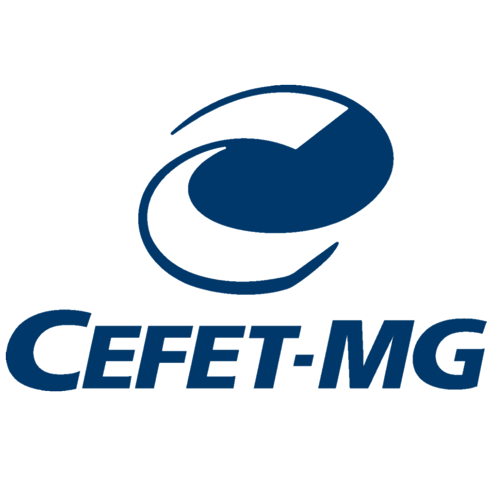

 
  

<h1 align="center" font-size="200em"><b>Ranqueamento de Documentos | TF-IDF</b></h1>

 

## Introdução

### Sobre o trabalho:

O TF-IDF (<i>Term Frequency-Inverse Document Frequency</i>) é uma medida estatística e um algoritmo dentro da ciência de dados, usado para determinar a importância da palavra de um documento em relação a um banco de documentos. Isso, então, pode ser usado para ranquear os documentos com base no grau de relevância deles em relação à palavra/frase selecionada.

Portanto, implementamos um algoritmo de ranqueamento de documentos em C++ usando o TF-IDF como o primeiro trabalho da disciplina de AEDS II, ministrada no Campus Divinópolis do CEFET-MG pelo professor Michel Pires Da Silva.

 

## Implementação:

### Bibliotecas utilizadas:
- `<cctype>`
- `<fstream>`
- `<iostream>`
- `<list>`
- `<string>`
- `<vector>`

## Compilação e Execução:

| Comando                |  Função                                                                                           |                     
  | -----------------------| ------------------------------------------------------------------------------------------------- |
  |  `make clean`          | Apaga a última compilação realizada contida na pasta build.                                       |
  |  `make`                | Executa a compilação do programa utilizando o g++, e o resultado vai para a pasta build.          |
  |  `make run`            | Executa o programa da pasta build após a realização da compilação.                                |

 

## Integrantes:

**Jader Oliveira Silva**  

**Rafael Adolfo Silva Ferreira**  

**Samuel Silva Gomes**  

